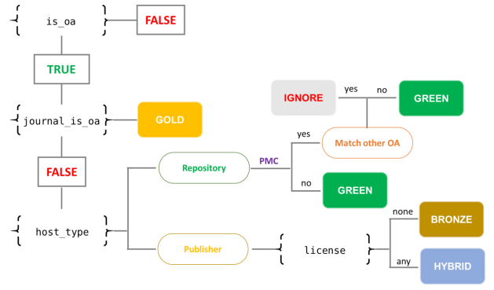

```{r echo = F, include = F}
# Load necessary libraries
library(tidyverse)

# Set chart themes
theme_set(theme_minimal() +
          theme(text = element_text(size=12),
                axis.text.x = element_text(angle=45, hjust=1),
                axis.title.x = element_text(margin = margin(t = 15, unit = "pt")),
                axis.title.y = element_text(margin = margin(r = 15, unit = "pt")),
                plot.title = element_text(margin = margin(t = 5, b = 15, unit = "pt"),
                                          hjust = 0.5)))

# Color palette
# From https://www.materialui.co/colors
palette <- c(
  `closed`      = "#9E9E9E",
  `open`        = "#00BCD4",
  `gold`        = "#FDD835",
  `hybrid`      = "#FB8C00",
  `bronze`      = "#BF360C",
  `green`       = "#4CAF50",
  `light green` = "#A5D6A7",
  `dark green`  = "#2E7D32")

palette_color <- function(color) {
  cols <- c(color)
  if (is.null(cols)) {
    return(NA)
  } else {
    return(unname(palette[color]))
  }
}
```

# Open Access and Altmetrics

This notebook contains documentation for the study on the relationship between Open Access (OA) and altmetrics.

## Web of Science

### Article Corpus

Articles were derived from the in-house Web of Science (WOS) database maintained by CWTS ([query](queries/create_table_wos_items.sql)).

The following tables were used to build the article corpus:

- woskb.dbo.cwts_ut
- woskb.dbo.cwts_pub_details

Extracted fields included:

- ut
- doi (limited to non-null values)
- year (limited to 2012:2018)
- n_authors
- n_institutes
- n_countries
- source (journal name)
- doc type (limited to 'Article' and 'Review')

DOIs were converted to lowercase for matching with other datasets (e.g. Unpaywall, Altmetric.com). A small number of DOIs (N ~ 250) were found to include a comma in the DOI string (causing issues with .csv export) and were thus removed.

##### Distribution of WOS articles per year ([query](#))

```{r echo = F, message = F}

read_csv("data/wos_items_year.csv") %>%
  ggplot() +
  geom_bar(aes(x = year, y = n_items), stat = "identity") +
  labs(x = "", 
       y = "Articles",
       "title" = "Distribution of WOS articles per year") +
  scale_x_continuous(breaks = 2012:2018) +
  scale_y_continuous(labels = scales::comma) 

```

### Author Countries

ISO Alpha-2 country codes of **first** authors were extracted for the set of articles defined above ([query](create_table_wos_first_authors.sql)), combining the following tables:

- userdb_frasernm.dbo.wos_items (as defined above)
- wosaddr1913.dbo.pub_author_affiliation
- wosaddr1913.dbo.pub_affiliation
- wosaddr1913.dbo.country

Where authors were affiliated with more than one country, country affiliations were weighted accordingly (e.g. an author belonging to the UK and US would count as 0.5 towards the UK, and 0.5 towards the US).

### Subject Classifications


## Altmetrics Data

Altmetrics count data were derived from the CWTS in-house database of Altmetric.com data (version October 2019)([query](queries/create_table_altmetric_counts.sql)). Counts were extracted for the following altmetric indicators:

- Blogs
- Facebook
- News
- Policy
- Twitter
- Wikipedia

Where no altmetric information was found for an article, counts were registered as zero.

## Altmetrics coverage


### Altmetrics counts

```{r}

```


## OA Classification

OA classification was conducted using data from Unpaywall. Unpaywall data (from the April 2019 data dump) has been parsed into a relational (SQL) database at CWTS. 

The following tables were used:

- unpaywall_2019apr_json.dbo.pub (article details)
- unpaywall_2019apr_json.dbo.pub_oa_location (article oa location details)

Articles were limited to those with a publication date between 2010 and 2019. This is slightly more inclusive than the WOS articles (2012-2019), to account for potential differences in recorded publication years between the two datasets (and thus ensures maximum coverage of WoS articles in the Unpaywall dataset).

OA classification was first conducted following the workflow detailed in Figure 1 from [Robinson-Garcia et al. (2019)](https://arxiv.org/abs/1906.03840):



This classification diverges from the OA classification scheme [used by Unpaywall directly](https://support.unpaywall.org/support/solutions/articles/44001777288-what-do-the-types-of-oa-status-green-gold-hybrid-and-bronze-mean-) in two ways:

* Green OA is a non-exclusive category, meaning that it can overlap with other journal-based OA categories. E.g. a paper can be published in a Gold OA journal, and hosted on a Green OA repository, and would thus be labelled both 'Gold' and 'Green'.
* Articles hosted on PubMed Central (PMC) are, however, not classified as Green OA *if* they are available through another OA outlet. As authors do not submit manuscripts to PMC directly, it is not a 'self-archiving' repository in the 'traditional' sense.

Some implications of these two points are considered below.

### PMC

To test the influence of the inclusion/exclusion of articles contained in PMC on Green OA rates, two classification procedures were conducted: one including all PMC articles in Green OA ([create_table_unpaywall_classification_nopmccor.sql](queries/create_table_unpaywall_classification_nopmccor.sql)), and one excluding PMC articles from Green OA when they match with an alternative kind of OA ([create_table_unpaywall_classification_pmccor.sql](queries/create_table_unpaywall_classification_pmccor.sql)).

The number of articles classified as Green OA are compared depending on whether PMC is included or excluded as a source of Green OA (note: this has no effect on other OA classification types):

```{r echo = F, message = F}

read_csv("data/unpaywall_classification_pmc_comparison.csv",
         col_types = "nln") %>%
  mutate(pmc_corrected = factor(pmc_corrected,
                                levels = c(T, F))) %>%
  ggplot() +
  geom_bar(aes(x = year, y = green, group = pmc_corrected, fill = pmc_corrected), 
           stat = "identity", position = "dodge") +
  labs(x = "", 
       y = "Green OA articles",
       title = "Green OA articles with and without PMC",
       fill = "Excludes PMC") +
  scale_x_continuous(breaks = 2010:2019) +
  scale_y_continuous(labels = scales::comma) +
  scale_fill_manual(values = c(palette_color("dark green"),
                               palette_color("light green")))
```

PMC clearly contributes a large proportion of Green OA from 2010 to 2017. In 2018 and 2019, no PMC articles are found to contribute to Green OA  - notably, no articles are found for these year in the Unpaywall data where the evidence is described as "oa repository (via pmcid lookup)". However, when checking the same articles from 2018 and 2019 directly via the Unpaywall API, PMC *is* included as an evidence source. A possibility is that Unpaywall only crawl PMC sporadically (as articles in Gold OA journals, such as PLOS ONE, are deposited immediately to PMC), or that a technical issue occurred.

The overlap of PMC with other journal-based OA types (gold, bronze, hybrid) was also assessed:

```{r echo = F, message = F}

read_csv("data/unpaywall_classification_pmc_overlap.csv") %>%
  pivot_longer(closed:bronze) %>%
  # there is no overlap between closed and PMC
  filter(name != "closed") %>%
  mutate(type = factor(name,
                       levels = c("gold", "hybrid", "bronze"))) %>%
  ggplot() +
  geom_bar(aes(x = year, y = value, fill = type),
           stat = "identity", position = "dodge", width = 0.75) +
  labs(x = "", 
       y = "Articles",
       title = "Overlap of articles in PMC with other OA types",
       fill = "OA Type") +
  scale_x_continuous(breaks = 2010:2019) +
  scale_y_continuous(labels = scales::comma) +
  scale_fill_manual(values = c(palette_color("gold"),
                               palette_color("hybrid"),
                               palette_color("bronze")))

```

PMC appears to overlap most strongly (and overlap has grown most rapidly) with Gold OA, but also a non-negligible amount with Hybrid and Bronze OA.

#### Should we exclude PMC from our analysis?

From these results there seems no 'a priori' reason to completely exclude PMC. Even though authors do not deposit work to PMC, it remains an open repository and discovery tool and may thus have an influence on article impact. An alternative may eventually be to create a separate category for PMC articles. For the following documentation, PMC articles are included and labelled as Green OA.

### Green OA

Following the classification procedure of Robinson-Garcia et al. (2019), Green OA is treated as a non-exclusive category, i.e. an article is labelled as Green if it is available via a repository, regardless of its availability status at the journal page. However, some questions remain about this approach in the context of understanding OA impact - for example, will authors really use (and be more likely to cite/mention) an article if it is an OA repository, when it is also available directly (and likely more easily) on a journal page? The impact dynamics are therefore likely different for Green OA, depending on the availability of the corresponding journal article.

To understand this better, the share of Green OA that is open (i.e. the sum of Gold, Green and Bronze OA) and closed at the journal page is shown:

```{r echo = F, message = F}
# Compare 
read_csv("data/unpaywall_classification_green_types.csv") %>%
  pivot_longer(all_green:only_green) %>%
  filter(name %in% c("journal_oa_green", "only_green")) %>%
  mutate(name = factor(name,
                       levels = c("only_green",
                                  "journal_oa_green"),
                       labels = c("Closed at journal page",
                                  "Open at journal page"))) %>%
  ggplot() +
  geom_bar(aes(x = year, y = value, fill = name), 
           stat = "identity", position = "dodge", width = 0.75) +
  labs(x = "", 
       y = "Articles",
       title = "Green OA by journal article availability",
       fill = "Article availability") +
  scale_x_continuous(breaks = 2010:2019) +
  scale_y_continuous(labels = scales::comma) +
  scale_fill_manual(values = c(palette_color("light green"),
                               palette_color("dark green")))
```

Interestingly, Green OA growth is driven more strongly by articles which are also available at the corresponding journal page. The decrease in Green OA coverage after 2018 is in part due to the issues with PMC coverage documented above, and also likely due to journal embargo periods. A more fine-grained analysis shows, for the articles available at the journal page, the number of articles contributing to Green OA for each journal type:

```{r echo = F, message = F}

read_csv("data/unpaywall_classification_green_types.csv") %>%
  pivot_longer(all_green:only_green) %>%
  filter(name %in% c("gold_green", "hybrid_green", "bronze_green")) %>%
  mutate(name = factor(name,
                       levels = c("gold_green",
                                  "hybrid_green",
                                  "bronze_green"),
                       labels = c("Gold",
                                  "Hybrid",
                                  "Bronze"))) %>%
  ggplot() +
  geom_bar(aes(x = year, y = value, fill = name),
           stat = "identity", position = "dodge", width = 0.75) +
  labs(x = "", 
       y = "Articles",
       title = "Green OA by journal type",
       fill = "OA Type") +
  scale_x_continuous(breaks = 2010:2019) +
  scale_y_continuous(labels = scales::comma) +
  scale_fill_manual(values = c(palette_color("gold"),
                               palette_color("hybrid"),
                               palette_color("bronze")))

```

The results show that in general, the contribution of Gold and Hybrid articles to Green OA shares has grown strongly between 2010 and 2017. Interestingly, the contribution of Bronze OA articles over this time period remains relatively static, and even falls marginally from 2014 onwards. 

#### Should Green OA articles be labelled at a more granular level?

...to discuss...

### Open Access shares

Including all data from Unpaywall:

```{r echo = F, message = F}

# Closed versus Open
read_csv("data/unpaywall_classification.csv") %>%
  pivot_longer(closed:only_green) %>%
  filter(name %in% c("closed", "oa")) %>%
  mutate(name = factor(name,
                       levels = c("closed",
                                  "oa"),
                       labels = c("Closed",
                                  "All OA"))) %>%
  ggplot() +
  geom_bar(aes(x = year, y = value, fill = name),
           stat = "identity", position = "dodge", width = 0.75) +
  labs(x = "", 
       y = "Articles",
       title = "Title here",
       fill = "Access Type") +
  scale_x_continuous(breaks = 2010:2019) +
  scale_y_continuous(labels = scales::comma) +
  scale_fill_manual(values = c(palette_color("closed"),
                               palette_color("open")))

read_csv("data/wos_unpaywall_classification.csv") %>%
  pivot_longer(closed:only_green) %>%
  filter(name %in% c("closed", "oa")) %>%
  mutate(name = factor(name,
                       levels = c("closed",
                                  "oa"),
                       labels = c("Closed",
                                  "All OA"))) %>%
  ggplot() +
  geom_bar(aes(x = year, y = value, fill = name),
           stat = "identity", position = "dodge", width = 0.75) +
  labs(x = "", 
       y = "Articles",
       title = "Title here",
       fill = "Access Type") +
  scale_x_continuous(breaks = 2010:2019) +
  scale_y_continuous(labels = scales::comma) +
  scale_fill_manual(values = c(palette_color("closed"),
                               palette_color("open")))
  

# By OA Journal Type
read_csv("data/unpaywall_classification.csv") %>%
  pivot_longer(closed:only_green) %>%
  filter(name %in% c("closed", "gold", "hybrid", "bronze", "green")) %>%
  mutate(name = factor(name,
                       levels = c("closed", "gold", "hybrid", "bronze", "green"),
                       labels = c("Closed", "Gold", "Hybrid", "Bronze", "Green"))) %>%
  ggplot() +
  geom_bar(aes(x = year, y = value, fill = name),
           stat = "identity", position = "dodge", width = 0.75) +
  labs(x = "", 
       y = "Articles",
       title = "Title here",
       fill = "Access Type") +
  scale_x_continuous(breaks = 2010:2019) +
  scale_y_continuous(labels = scales::comma) +
  scale_fill_manual(values = c(palette_color("closed"),
                               palette_color("gold"),
                               palette_color("hybrid"),
                               palette_color("bronze"),
                               palette_color("green")))

read_csv("data/wos_unpaywall_classification.csv") %>%
  pivot_longer(closed:only_green) %>%
  filter(name %in% c("closed", "gold", "hybrid", "bronze", "green")) %>%
  mutate(name = factor(name,
                       levels = c("closed", "gold", "hybrid", "bronze", "green"),
                       labels = c("Closed", "Gold", "Hybrid", "Bronze", "Green"))) %>%
  ggplot() +
  geom_bar(aes(x = year, y = value, fill = name),
           stat = "identity", position = "dodge", width = 0.75) +
  labs(x = "", 
       y = "Articles",
       title = "Title here",
       fill = "Access Type") +
  scale_x_continuous(breaks = 2010:2019) +
  scale_y_continuous(labels = scales::comma) +
  scale_fill_manual(values = c(palette_color("closed"),
                               palette_color("gold"),
                               palette_color("hybrid"),
                               palette_color("bronze"),
                               palette_color("green")))

# Splitting Green OA types
read_csv("data/unpaywall_classification.csv") %>%
  pivot_longer(closed:only_green) %>%
  filter(name %in% c("journal_green", "only_green")) %>%
  mutate(name = factor(name,
                       levels = c("only_green", "journal_green"),
                       labels = c("Closed at journal page",
                                  "Open at journal page"))) %>%
  ggplot() +
  geom_bar(aes(x = year, y = value, fill = name),
           stat = "identity", position = "dodge", width = 0.75) +
  labs(x = "", 
       y = "Articles",
       title = "Green OA by journal article availability",
       fill = "Article availability") +
  scale_x_continuous(breaks = 2010:2019) +
  scale_y_continuous(labels = scales::comma) +
  scale_fill_manual(values = c(palette_color("light green"),
                               palette_color("dark green")))

read_csv("data/wos_unpaywall_classification.csv") %>%
  pivot_longer(closed:only_green) %>%
  filter(name %in% c("journal_green", "only_green")) %>%
  mutate(name = factor(name,
                       levels = c("only_green", "journal_green"),
                       labels = c("Closed at journal page",
                                  "Open at journal page"))) %>%
  ggplot() +
  geom_bar(aes(x = year, y = value, fill = name),
           stat = "identity", position = "dodge", width = 0.75) +
  labs(x = "", 
       y = "Articles",
       title = "Green OA by journal article availability",
       fill = "Article availability") +
  scale_x_continuous(breaks = 2010:2019) +
  scale_y_continuous(labels = scales::comma) +
  scale_fill_manual(values = c(palette_color("light green"),
                               palette_color("dark green")))

```


