R Notebook
================
Nicholas Fraser

# Open Access and Altmetrics

This R notebook contains documentation for the study on the relationship
between Open Access (OA) and altmetrics.

## Background

\[TBC\]

Important: \* <https://doi.org/10.1007/s11192-019-03301-x> \*
<https://doi.org/10.1002/bult.2013.1720390406> \*
<https://doi.org/10.3145/epi.2020.ene.02> \*
<https://openaccess.leidenuniv.nl/handle/1887/65221> \*
<https://www.ideals.illinois.edu/bitstream/handle/2142/73451/212_ready.pdf>

## Research Questions

The study aims to address the following research questions:

  - **RQ1**: Do OA articles receive more altmetric attention than non-OA
    articles?
  - **RQ2**: Do articles with different *types* of OA differ in the
    altmetric attention they receive?
  - **RQ3**: Which additional factors influence the relationship between
    OA and altmetrics?
  - **RQ4**: What are the limitations with current data sources in
    measuring the large-scale relationship between OA and altmetrics?

With respect to RQ3, the following factors will be investigated:

  - Time
  - Document types (article versus review documents)
  - Discipline
  - Country of authorship
  - Publication venue (journal prestige)

## Data Sources

### Article Corpus (Web of Science)

Articles were derived from the in-house Web of Science (WOS) database
maintained by CWTS ([query](queries/create_table_wos_items.sql)).

The following tables were used to build the article corpus:

  - woskb.dbo.cwts\_ut
  - woskb.dbo.cwts\_pub\_details

Extracted fields included:

  - ut
  - doi (limited to non-null values)
  - year (limited to 2012:2018)
  - n\_authors
  - n\_institutes
  - n\_countries
  - source (journal name)
  - doc type (limited to ‘Article’ and ‘Review’)

DOIs were converted to lowercase for matching with other datasets
(e.g. Unpaywall, Altmetric.com).

##### Distribution of WOS articles per year ([query](queries/calc_wos_items_year.sql))

<!-- -->

### Author Countries

ISO Alpha-2 country codes of **first** authors were extracted for the
set of articles defined above
([query](queries/create_table_wos_first_author_countries.sql)),
combining the following tables:

  - userdb\_frasernm.dbo.wos\_items (as defined above)
  - wosaddr1913.dbo.pub\_author\_affiliation
  - wosaddr1913.dbo.pub\_affiliation
  - wosaddr1913.dbo.country

Two potential methods for counting of country affiliations were
explored: full counting and fractional counting. Full counting means
that a paper is fully associated with any country affiliation of an
author, e.g. if an author has two affiliations, one in the US and one in
the UK, the paper would be counted as an article for the output of both
countries. Fractional counting means that where an author has
affiliations in multiple countries, an article is weighted by the number
of country affiliations of the author, e.g. for an author with
affiliations in the US and UK, an article would count as 0.5 towards the
output of the UK, and 0.5 towards the output of the US.

##### Top 50 countries included in the WOS article corpus by full counting ([query](queries/calc_wos_items_country_full_counting.sql))

<!-- -->

##### Top 50 countries included in WOS article corpus by fractional counting ([query](queries/calc_wos_items_country_fractional_counting.sql))

<!-- -->

##### Difference in country output using full versus fractional

<!-- -->

#### Recommendations for counting methodology

The results show that per-country output varies strongly depending on
whether full or fractional counting is used (in some cases, e.g. in
Saudi Arabia, counts are nearly 20 % lower when using fractional versus
full counting). Potential reasons for this may be that authors from
smaller countries, or countries with less well-developed scientific
systems, are more likely to need to collaborate with partners from other
countries, or that collaborations are driven by external motivations
such as funding sources which explicitly require multi-country
collaborations (e.g. EU FP7). To prevent penalisation of authors in
these countries, for the following study full-counting at the country
level is used.

### Subject Classifications

Subject classifications are assigned to 5 major subject areas, which
conform to the subject classifications used in the [Leiden
Ranking](https://leidenranking.com). The fields are defined
algorithmically (as outlined
[here](https://leidenranking.com/information/fields)), based on the
publication-level classification system detailed in [Waltman and van Eck
(2012)](https://onlinelibrary.wiley.com/doi/full/10.1002/asi.22748). In
brief terms, publications are initially clustered into research areas at
3 levels of granularity, based on citation relations. The classification
system here uses the level of highest granularity, where publications
are clustered into 4535 micro-level fields of science. For each
micro-level field, the overlap with each of the 252 WOS subject areas
(excluding Multidisciplinary Sciences) is determined. Each of these 252
subject categories is then assigned to the 5 main fields of the Leiden
Ranking.

For this study, classification was conducted using the following tables
([query](queries/create_table_wos_classification.sql)):

  - userdb\_frasernm.dbo.wos\_items (as defined above)
  - wosclassification1913.dbo.clustering
  - wosclassification1913.dbo.cluster\_LR\_main\_field3
  - wosclassification1913.dbo.LR\_main\_field

For subject classification, we use only fractional counting to weight
articles towards their respective subject (i.e. a publication belonging
to both “Biomedical and Health Sciences” and “Life and Earth Sciences”
would be assigned a weight of 0.5 for both fields).

##### Proportion of WOS articles contained in each subject classification ([query](queries/calc_wos_items_classification.sql))

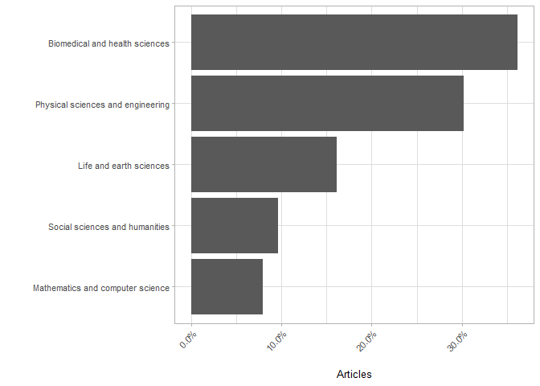<!-- -->

### Altmetrics Data

Altmetrics data were derived from the CWTS in-house database of
Altmetric.com (version October 2019)
([query](queries/create_table_altmetric_counts.sql)), using the
following tables:

  - userdb\_frasernm.dbo.wos\_items (as defined above)
  - altmetric\_2019oct.dbo.pub\_citation
  - altmetric\_2019oct.dbo.pub\_counts

Counts were initially extracted for the following altmetric indicators:

  - Blogs
  - Facebook
  - News
  - Policy
  - Twitter
  - Wikipedia

Where no altmetric information was found for an article, counts were
registered as zero.

The following metrics are used for measuring altmetric activity:

  - **Altmetric Coverage**: The number of articles that are mentioned in
    a given altmetric source. E.g. if 30 articles out of 100 total
    articles are mentioned on Twitter, the Twitter coverage is 30%.
  - **Relative Altmetric Coverage**: The number of articles that are
    mentioned in a given altmetric source **for a specific subset of a
    population**, relative to the entire population. This can be
    explained with the following example: a population of 100 articles
    consists of 40 OA and 60 non-OA articles. The Twitter coverage of
    the entire population is 30%, but the coverage of the OA group is
    50%. Thus, the relative coverage of the OA group is 50/30 = 1.66. An
    interpretation is that OA articles are mentioned 66% more often on
    Twitter than the population as a whole.

### OA Classification

OA classification was conducted using data from Unpaywall. Unpaywall
data (from the April 2019 data dump) has been parsed into a relational
(SQL) database at CWTS.

The following tables were used:

  - unpaywall\_2019apr\_json.dbo.pub (article details)
  - unpaywall\_2019apr\_json.dbo.pub\_oa\_location (article oa location
    details)

Articles were limited to those with a publication date between 2010 and
2019. This is slightly more inclusive than the WOS articles (2012-2019),
to account for potential differences in recorded publication years
between the two datasets (and thus ensures maximum coverage of WoS
articles in the Unpaywall dataset).

OA classification was first conducted following the workflow detailed in
Figure 1 from [Robinson-Garcia et
al. (2019)](https://arxiv.org/abs/1906.03840):


This classification scheme diverges from the OA classification scheme
[used by Unpaywall
directly](https://support.unpaywall.org/support/solutions/articles/44001777288-what-do-the-types-of-oa-status-green-gold-hybrid-and-bronze-mean-)
in two ways:

  - Green OA is a non-exclusive category, meaning that it can overlap
    with other journal-based OA categories. E.g. a paper can be
    published in a Gold OA journal, and hosted on a Green OA repository,
    and would thus be labelled both ‘Gold’ and ‘Green’.
  - Articles hosted on PubMed Central (PMC) are, however, not classified
    as Green OA *if* they are available through another OA outlet. As
    authors do not submit manuscripts to PMC directly, it is not a
    ‘self-archiving’ repository in the ‘traditional’ sense.

Some implications of these two points are considered below.

#### PMC

To test the influence of the inclusion/exclusion of articles contained
in PMC on Green OA rates, two classification procedures were conducted:
one including all PMC articles in Green OA
([create\_table\_unpaywall\_classification\_nopmccor.sql](queries/create_table_unpaywall_classification_nopmccor.sql)),
and one excluding PMC articles from Green OA when they match with an
alternative kind of OA
([create\_table\_unpaywall\_classification\_pmccor.sql](queries/create_table_unpaywall_classification_pmccor.sql)).

##### Green OA articles in Unpaywall including and excluding PMC ([query](queries/calc_unpaywall_classification_pmc_comparison.sql))

<!-- -->

PMC contributes a large proportion of Green OA from 2010 to 2017. In
2018 and 2019, no PMC articles are found to contribute to Green OA -
notably, no articles are found for these year in the Unpaywall data
where the evidence is described as “oa repository (via pmcid lookup)”.
However, when checking the same articles from 2018 and 2019 directly via
the Unpaywall API, PMC *is* included as an evidence source. A
possibility is that Unpaywall only crawl PMC sporadically (as articles
in Gold OA journals, such as PLOS ONE, are deposited immediately to
PMC), or that a technical issue occurred \[**to do:** investigate this
issue further. Contact Unpaywall?\]

##### Overlap of articles in PMC with journal-based OA types ([query](queries/calc_unpaywall_classification_pmc_overlap.sql))

<!-- -->

PMC appears to overlap most strongly (and overlap has grown most
rapidly) with Gold OA, but also a non-negligible amount with Hybrid and
Bronze OA. Note, as previously, PMC articles are missing from 2018 and
2019.

#### Exclusivity of Green OA

Following the classification procedure of Robinson-Garcia et al. (2019),
Green OA is treated as a non-exclusive category, i.e. an article is
labelled as Green if it is available via a repository, regardless of its
availability status at the journal page. However, some questions remain
about this approach in the context of understanding OA impact - for
example, from the readership perspective, will readers really use (and
be more likely to cite/mention) an article if it is an OA repository,
when it is also available directly on a journal page? And from the
authors perspective - do the authors who publish in OA journals **and**
self-archive their papers represent a different demographic/category of
authors, than those who **only** self-archive? The impact dynamics are
therefore likely different for Green OA, depending on the availability
of the corresponding journal article.

##### Number of articles in repositories that are open and closed at the corresponding journal page ([query](queries/calc_unpaywall_classification_green_types.sql))

<!-- -->

It appears tha growth in Green OA between 2010 and 2017 is stronger for
articles which are also available at the corresponding journal page,
than closed articles. Note, however, that the above figures includes PMC
articles - as shown in the previous section, there is also a large
overlap of PMC with Gold OA, and to a lesser extent with Hybrid and
Bronze OA.

##### Number of Green OA articles published in different types of OA journals ([query](queries/calc_unpaywall_classification_green_types.sql))

<!-- -->

The results show that the contribution of Gold articles to Green OA
shares has grown most strongly between 2010 and 2017. However,
approximately 75% of the growth can be attributed to growth in deposits
to PMC. Interestingly, whilst the contribution of Hybrid OA has grown
over this time period, the contribution of Bronze OA remains relatively
static, and even falls marginally from 2014 onwards.

#### Recommendations for classifying Green OA

From the above results, a general recommendation is that Green OA should
not be considered a ‘black box’ in the context of understanding impact
metrics, as it includes multiple archiving routes, and interacts
strongly with other forms of OA. However, creating many other
‘categories’ of Green OA (i.e. one category for Green OA including PMC
and one excluding PMC) for analysis purposes is also sub-optimal, as
categories will become increasingly granular and large-scale mechanisms
influencing impact are lost.

For simplification purposes, PMC is therefore excluded as a form of
Green OA in this study. The reasoning for this is based on: (1) that PMC
clearly represents a different *form* of archiving than other forms of
Green OA, i.e. the author takes no direct action to deposit their work,
(2) that PMC largely overlaps with other forms of journal-based OA, in
particular with Gold OA, which may skew results towards these OA forms,
and (3) there exist data quality issues, with respect to missing PMC
data in 2018 and 2019.

<!-- -->

## Results

### Altmetric Coverage and OA

Here the large-scale relationship between coverage of altmetric
indicators and their OA status is explored.

#### By Year

Note: Year refers to the WOS publication year (not the publication year
stored by Unpaywall)

##### Total altmetric coverage per indicator ([query](queries/calc_altmetrics_coverage_year.sql))

<!-- -->

The highest coverage is observed in Twitter, followed by Facebook, then
news and blogs, Wikipedia and policies. Different temporal trends are
observed for each indicator, e.g. Twitter coverage increases between
2012 and 2016, which may reflect rapid user growth on the platform
itself. Conversely, policy citations decrease over time, likely because
policy citations take longer to accrue (\~years) than mentions on social
media (\~days to weeks) (see [Fang and
Costas, 2018](https://openaccess.leidenuniv.nl/handle/1887/65278)).

##### Relative altmetric coverage in OA versus non-OA publications ([query](queries/calc_altmetrics_coverage_year_oa.sql))

<!-- -->

In general terms, OA articles receive greater coverage in all altmetric
indicators than non-OA articles for all years. The advantage is
surprisingly stable across altmetric indicators, with values of relative
coverage between 1.25-1.75 for OA articles (i.e. OA articles receive
25-75 % more coverage than the baseline coverage of all articles). For
some indicators, e.g. Facebook, news articles, Twitter and Wikipedia,
the relative coverage of OA articles reduces over time, whilst for blogs
relative coverage remains relatively stable, and even increases
marginally for policies.

##### Relative altmetric coverage in different access types ([query](queries/calc_altmetrics_coverage_year_oa_types.sql))

<!-- -->

Different trends are observed within each type of OA. A broad
generalisation is that for most indicators, with the exception of
Twitter, Bronze OA ‘performs’ well with respect to relative coverage,
whilst Gold OA performs poorly. However, the temporal trends are not
entirely clear - for example, with respect to Facebook, the relative
coverage of Gold OA was in fact the highest of all types of OA in 2012,
but by 2018 the decreases to the lowest of all OA types. Policy
documents in particular show a large separation in coverage between Gold
OA and other types of OA - the reasons for this will be investigated in
a later section.

#### By Document Type

##### Total altmetric coverage per indicator ([query](queries/calc_altmetrics_coverage_doctype.sql))

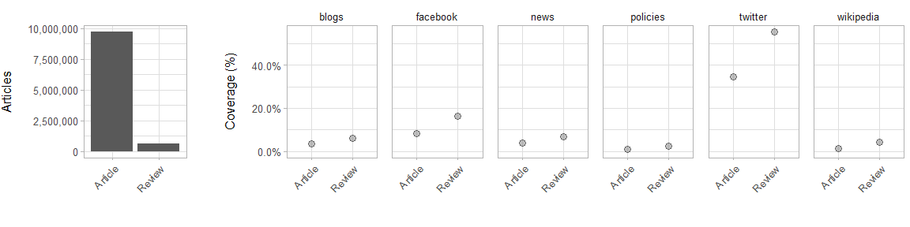<!-- -->
\#\#\#\#\# Relative altmetric coverage in OA versus non-OA publications
([query](queries/calc_altmetrics_coverage_doctype_oa.sql))

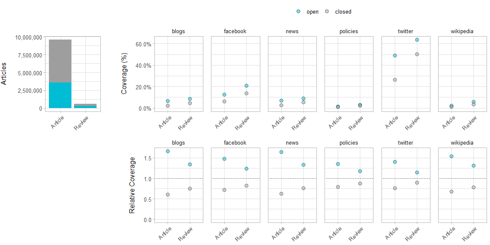<!-- -->

##### Relative altmetric coverage in different access types ([query](queries/calc_altmetrics_coverage_doctype_oa_types.sql))

<!-- -->

#### By Classification

##### Abbrevations for subject classifications

For the following section, names of individual subject classifications
are abbreviated as follows:

  - BHS: Biomedical and Health Sciences
  - LES: Life and Earth Sciences
  - MCS: Mathematics and Computer Sciences
  - PSE: Physical Sciences and Engineering
  - SSH: Social Sciences and Humanities

##### Total altmetric coverage per indicator ([query](queries/calc_altmetrics_coverage_classification.sql))

<!-- -->

Higher altmetric coverage is observed in BHS, LES and SSH than MCS and
PSE. SSH has the highest coverage on blogs and in policy documents,
whilst on Facebook and Twitter the highest coverage is observed in BHS.
MCS has the lowest coverage across all indicators.

##### Relative altmetric coverage in OA versus non-OA publications ([query](queries/calc_altmetrics_coverage_classification_oa.sql))

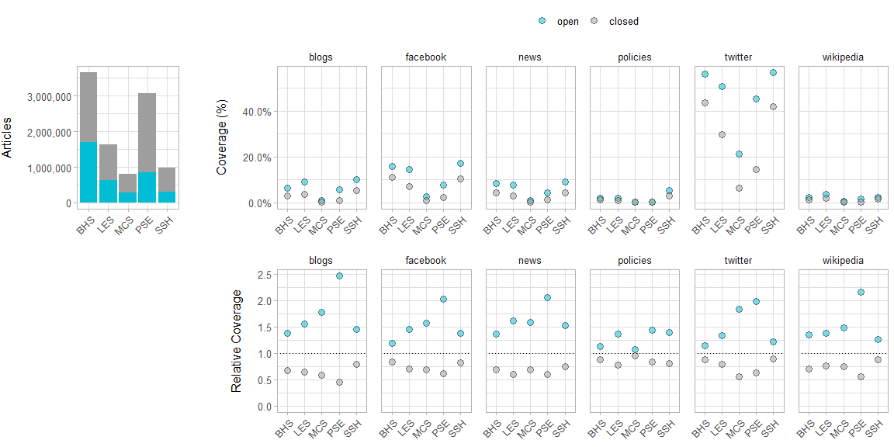<!-- -->

Interestingly, whilst PSE and MCS were shown in the previous figure to
have generally lower coverage across all indicators than other subject
classifications, the relative coverage of OA publications in PSE and MCS
is generally higher than in BHS, LES and SSH. An exception to this is in
policy mentions, where relative coverage of OA publication in PSE is
similar to LES and SSH, whilst in MCS the relative coverage of OA
publications is only slightly greater than 1.

##### Relative altmetric coverage in different access types ([query](queries/calc_altmetrics_coverage_classification_oa_types.sql))

<!-- -->

High coverage of PSE in OA publications appears to be driven mainly by
Green and Bronze OA. With respect to blogs and Wikipedia, Bronze OA has
by far the highest coverage, which appears to be driven strongly by a
small selection of ‘high impact’ journals in Astronomy. Conversely, for
Twitter and Facebook, the highest coverage in PSE is in Green OA - it
would be interesting to investigate whether this is due to availability
of Green OA on arXiv.

#### By Country

For the following analysis, the top 5 countries per region (Africa,
Americas, Europe, Asia, Oceania) by publishing volume are included. For
Oceania, only Australia and New Zealand are included as publishing
volumes for other countries were found to be extremely low.

##### Total altmetric coverage per indicator ([query](queries/calc_altmetrics_coverage_country.sql))

<!-- -->

##### Relative altmetric coverage in OA versus non-OA publications ([query](queries/calc_altmetrics_coverage_country_oa.sql))

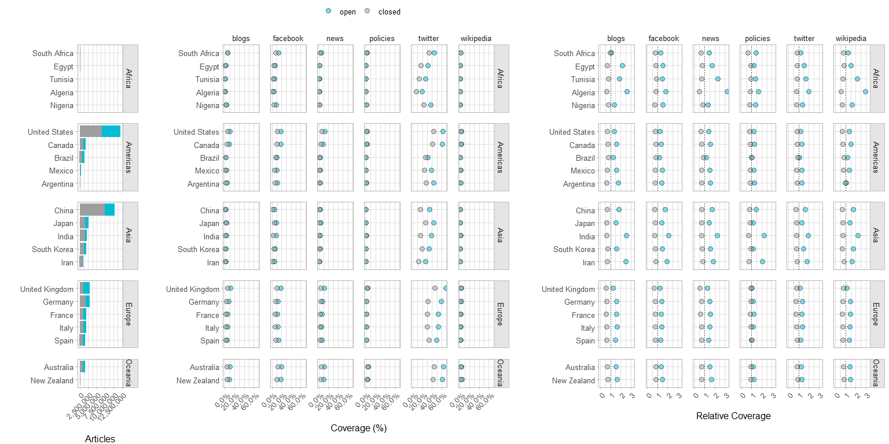<!-- -->

##### Relative altmetric coverage in different access types ([query](queries/calc_altmetrics_coverage_country_oa_types.sql))

<!-- -->

#### By Journal

There are 11,149 distinct journal titles associated with our WOS sample.
In the following section, journals are grouped into percentiles on the
basis of their Journal Impact Factor (downloaded from Clarivate
Analytics Journal Citation Reports), as a proxy for journal prestige.

\[To discuss: is JIF really a good proxy for journal prestige? Could we
use some other measure? Should we correct for JIF variability between
subject areas?\]

##### Total altmetric coverage per indicator ([query](queries/calc_altmetrics_coverage_journal.sql))

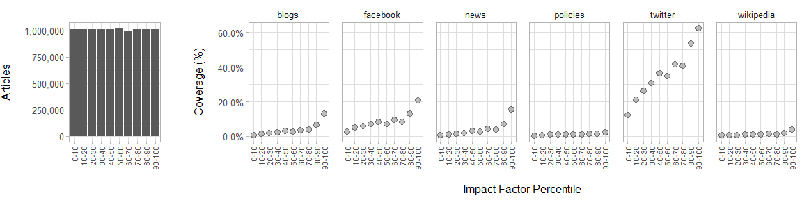<!-- -->

##### Relative altmetric coverage in OA versus non-OA publications ([query](queries/calc_altmetrics_coverage_journal_oa.sql))

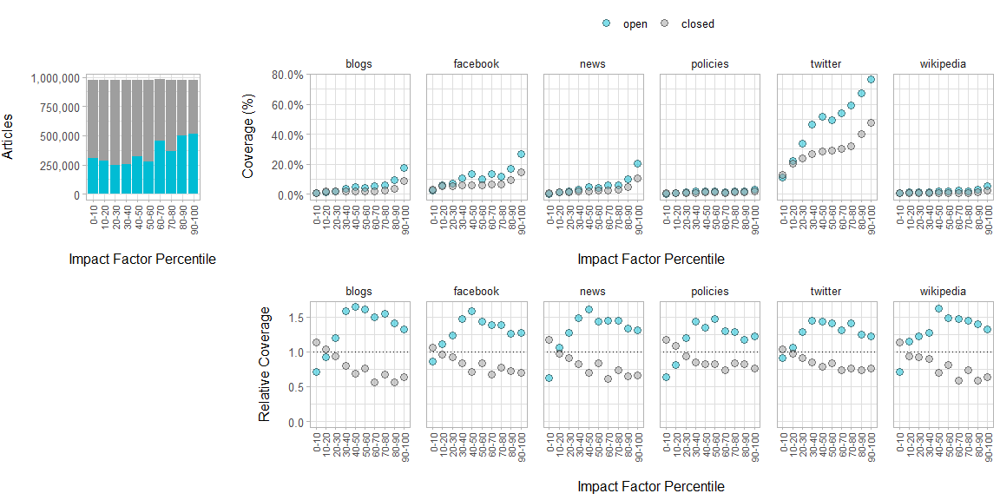<!-- -->

##### Relative altmetric coverage in different access types ([query](queries/calc_altmetrics_coverage_journal_oa_types.sql))

<!-- -->

  - High coverage of Gold OA in blogs, Facebook and Twitter in 40-50th
    percentile. Not clear why - several large, biomedical/health-focused
    Gold OA journals (not including PLOS ONE) are in this category which
    have high counts.
  - High Wikipedia coverage of Bronze OA in 40-50th percentile is due to
    high coverage in a single journal: “International Journal of
    Systematic and Evolutionary Microbiology” which is cited in
    Wikipedia 1476 times - the journal publishes papers which establish
    names of new bacteria.

## Discussion: opportunities and limitations of using altmetrics to measure the ‘social impact’ of Open Access

Key points:

  - Almost all units of analysis (years, subject classifications,
    countries, journal prestige) show a large ‘altmetrics advantage’ of
    OA publications over non-OA publications. A general exception
    appears to be in low-prestige (or at least low-IF) journals, where
    the opposite relationship is true.
  - There exists great variability in the response of altmetrics to the
    *type* of OA, an example being in policy documents, where Gold OA is
    cited relatively less frequently than other forms of OA.
  - The units of analysis here should not be considered in isolation,
    e.g. there is likely interaction between the country of authorship
    and subject classifications, as countries may prioritise research in
    different areas.
  - The data gathered and presented above are purely observational, and
    thus it is difficult to extract causal relationships
  - There exist significant barriers to overcome with respect to the
    data sources themselves, both for bibliometric databases and
    altmetrics sources.

The last point is explored in more detail below:

### Data Sources

#### Geographical bias in altmetrics data

##### Geographical bias in Twitter ([query](queries/calc_twitter_countries.sql))

<!-- -->

##### Geographical bias in policy documents ([query](queries/calc_policy_countries.sql))

<!-- -->

``` r
read_csv("data/twitter_timediff_oa.csv") %>%
  mutate(type = factor(type, levels = c("open", "closed"))) %>%
  filter(timediff > 0) %>%
  group_by(type) %>%
  arrange(timediff) %>%
  mutate(proportion = n_items/sum(n_items),
         cumulative_proportion = cumsum(proportion)) %>%
  ggplot() +
  geom_point(aes(x = timediff, y = cumulative_proportion, fill = type), 
             shape = 21, size = 2, alpha = 0.5) +
  scale_y_continuous(labels = scales::percent) +
  scale_x_continuous(limit = c(-0.5, 100.5)) +
  scale_fill_manual(values = c(palette_color("open"), 
                               palette_color("closed"))) +
  labs(x = "Time difference (days)",
       y = "Proportion of all tweets received")
```

    ## Parsed with column specification:
    ## cols(
    ##   type = col_character(),
    ##   timediff = col_double(),
    ##   n_items = col_double()
    ## )

    ## Warning: Removed 1082 rows containing missing values (geom_point).

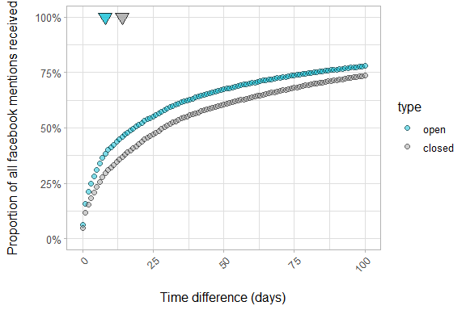<!-- -->

``` r
read_csv("data/twitter_timediff_oa_types.csv") %>%
  mutate(type = factor(type, 
                       levels = c("closed", "gold", "hybrid", "bronze", "green"))) %>%
  filter(timediff > 0) %>%
  group_by(type) %>%
  arrange(timediff) %>%
  mutate(proportion = n_items/sum(n_items),
         cumulative_proportion = cumsum(proportion)) %>%
  ggplot() +
  geom_point(aes(x = timediff, y = cumulative_proportion, fill = type), 
             shape = 21, size = 2, alpha = 0.5) +
  scale_y_continuous(labels = scales::percent) +
  scale_x_continuous(limit = c(-0.5, 100.5)) +
  scale_fill_manual(values = c(palette_color("closed"), 
                               palette_color("gold"),
                               palette_color("hybrid"),
                               palette_color("bronze"),
                               palette_color("green"))) +
  labs(x = "Time difference (days)",
       y = "Proportion of all tweets received")
```

    ## Parsed with column specification:
    ## cols(
    ##   type = col_character(),
    ##   timediff = col_double(),
    ##   n_items = col_double()
    ## )

    ## Warning: Removed 2703 rows containing missing values (geom_point).

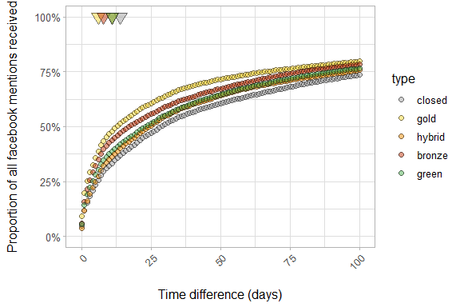<!-- -->

``` r
read_csv("data/facebook_timediff_oa.csv") %>%
  mutate(type = factor(type, levels = c("open", "closed"))) %>%
  filter(timediff > 0) %>%
  group_by(type) %>%
  arrange(timediff) %>%
  mutate(proportion = n_items/sum(n_items),
         cumulative_proportion = cumsum(proportion)) %>%
  ggplot() +
  geom_point(aes(x = timediff, y = cumulative_proportion, fill = type), 
             shape = 21, size = 2, alpha = 0.5) +
  scale_y_continuous(labels = scales::percent) +
  scale_x_continuous(limit = c(-0.5, 100.5)) +
  scale_fill_manual(values = c(palette_color("open"), 
                               palette_color("closed"))) +
  labs(x = "Time difference (days)",
       y = "Proportion of all tweets received")
```

    ## Parsed with column specification:
    ## cols(
    ##   type = col_character(),
    ##   timediff = col_double(),
    ##   n_items = col_double()
    ## )

    ## Warning: Removed 1074 rows containing missing values (geom_point).

<!-- -->

``` r
read_csv("data/facebook_timediff_oa_types.csv") %>%
  mutate(type = factor(type, 
                       levels = c("closed", "gold", "hybrid", "bronze", "green"))) %>%
  filter(timediff > 0) %>%
  group_by(type) %>%
  arrange(timediff) %>%
  mutate(proportion = n_items/sum(n_items),
         cumulative_proportion = cumsum(proportion)) %>%
  ggplot() +
  geom_point(aes(x = timediff, y = cumulative_proportion, fill = type), 
             shape = 21, size = 2, alpha = 0.5) +
  scale_y_continuous(labels = scales::percent) +
  scale_x_continuous(limit = c(-0.5, 100.5)) +
  scale_fill_manual(values = c(palette_color("closed"), 
                               palette_color("gold"),
                               palette_color("hybrid"),
                               palette_color("bronze"),
                               palette_color("green"))) +
  labs(x = "Time difference (days)",
       y = "Proportion of all tweets received")
```

    ## Parsed with column specification:
    ## cols(
    ##   type = col_character(),
    ##   timediff = col_double(),
    ##   n_items = col_double()
    ## )

    ## Warning: Removed 2606 rows containing missing values (geom_point).

<!-- -->

``` r
read_csv("data/news_timediff_oa.csv") %>%
  mutate(type = factor(type, levels = c("open", "closed"))) %>%
  filter(timediff > 0) %>%
  group_by(type) %>%
  arrange(timediff) %>%
  mutate(proportion = n_items/sum(n_items),
         cumulative_proportion = cumsum(proportion)) %>%
  ggplot() +
  geom_point(aes(x = timediff, y = cumulative_proportion, fill = type), 
             shape = 21, size = 2, alpha = 0.5) +
  scale_y_continuous(labels = scales::percent) +
  scale_x_continuous(limit = c(-0.5, 100.5)) +
  scale_fill_manual(values = c(palette_color("open"), 
                               palette_color("closed"))) +
  labs(x = "Time difference (days)",
       y = "Proportion of all tweets received")
```

    ## Parsed with column specification:
    ## cols(
    ##   type = col_character(),
    ##   timediff = col_double(),
    ##   n_items = col_double()
    ## )

    ## Warning: Removed 1074 rows containing missing values (geom_point).

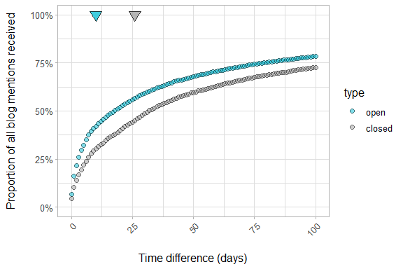<!-- -->

``` r
read_csv("data/news_timediff_oa_types.csv") %>%
  mutate(type = factor(type, 
                       levels = c("closed", "gold", "hybrid", "bronze", "green"))) %>%
  filter(timediff > 0) %>%
  group_by(type) %>%
  arrange(timediff) %>%
  mutate(proportion = n_items/sum(n_items),
         cumulative_proportion = cumsum(proportion)) %>%
  ggplot() +
  geom_point(aes(x = timediff, y = cumulative_proportion, fill = type), 
             shape = 21, size = 2, alpha = 0.5) +
  scale_y_continuous(labels = scales::percent) +
  scale_x_continuous(limit = c(-0.5, 100.5)) +
  scale_fill_manual(values = c(palette_color("closed"), 
                               palette_color("gold"),
                               palette_color("hybrid"),
                               palette_color("bronze"),
                               palette_color("green"))) +
  labs(x = "Time difference (days)",
       y = "Proportion of all tweets received")
```

    ## Parsed with column specification:
    ## cols(
    ##   type = col_character(),
    ##   timediff = col_double(),
    ##   n_items = col_double()
    ## )

    ## Warning: Removed 2621 rows containing missing values (geom_point).

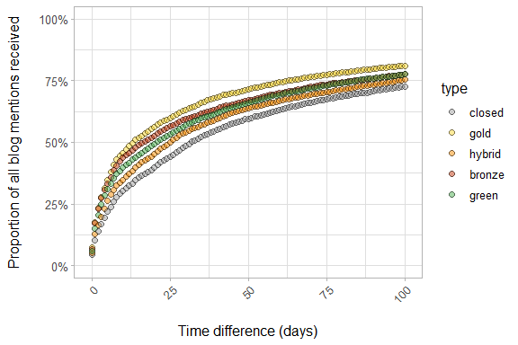<!-- -->

``` r
read_csv("data/wikipedia_timediff_oa.csv") %>%
  mutate(type = factor(type, levels = c("open", "closed"))) %>%
  filter(timediff > 0) %>%
  group_by(type) %>%
  arrange(timediff) %>%
  mutate(proportion = n_items/sum(n_items),
         cumulative_proportion = cumsum(proportion)) %>%
  ggplot() +
  geom_point(aes(x = timediff, y = cumulative_proportion, fill = type), 
             shape = 21, size = 2, alpha = 0.5) +
  scale_y_continuous(labels = scales::percent) +
  scale_x_continuous(limit = c(-0.5, 100.5)) +
  scale_fill_manual(values = c(palette_color("open"), 
                               palette_color("closed"))) +
  labs(x = "Time difference (days)",
       y = "Proportion of all tweets received")
```

    ## Parsed with column specification:
    ## cols(
    ##   type = col_character(),
    ##   timediff = col_double(),
    ##   n_items = col_double()
    ## )

    ## Warning: Removed 1019 rows containing missing values (geom_point).

<!-- -->

``` r
read_csv("data/wikipedia_timediff_oa_types.csv") %>%
  mutate(type = factor(type, 
                       levels = c("closed", "gold", "hybrid", "bronze", "green"))) %>%
  filter(timediff > 0) %>%
  group_by(type) %>%
  arrange(timediff) %>%
  mutate(proportion = n_items/sum(n_items),
         cumulative_proportion = cumsum(proportion)) %>%
  ggplot() +
  geom_point(aes(x = timediff, y = cumulative_proportion, fill = type), 
             shape = 21, size = 2, alpha = 0.5) +
  scale_y_continuous(labels = scales::percent) +
  scale_x_continuous(limit = c(-0.5, 100.5)) +
  scale_fill_manual(values = c(palette_color("closed"), 
                               palette_color("gold"),
                               palette_color("hybrid"),
                               palette_color("bronze"),
                               palette_color("green"))) +
  labs(x = "Time difference (days)",
       y = "Proportion of all tweets received")
```

    ## Parsed with column specification:
    ## cols(
    ##   type = col_character(),
    ##   timediff = col_double(),
    ##   n_items = col_double()
    ## )

    ## Warning: Removed 2278 rows containing missing values (geom_point).

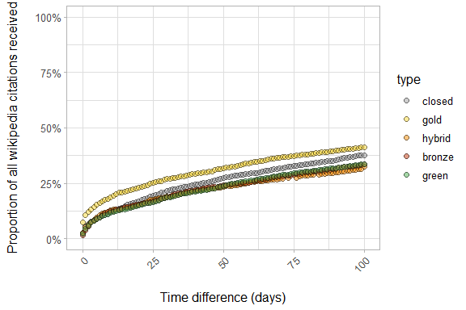<!-- -->
